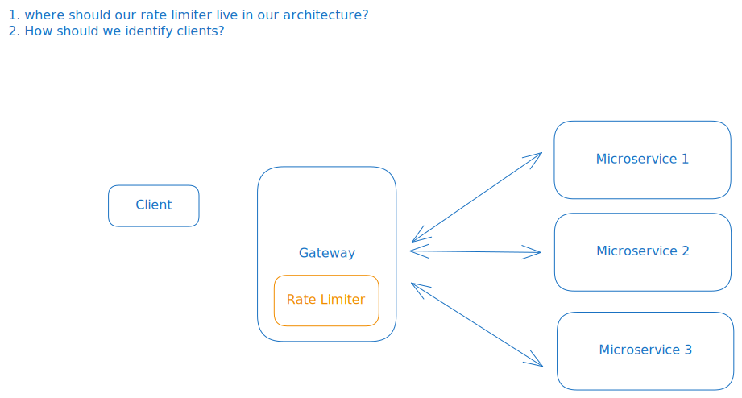
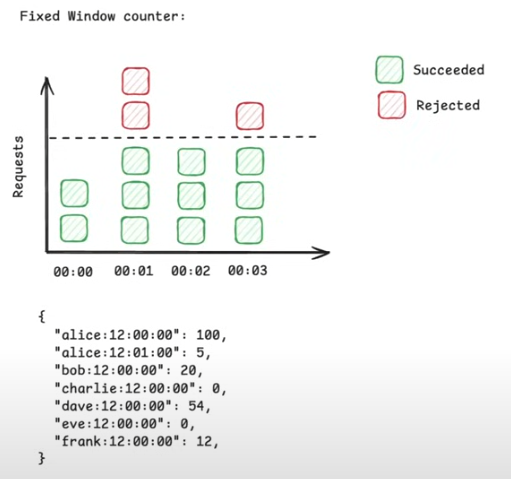
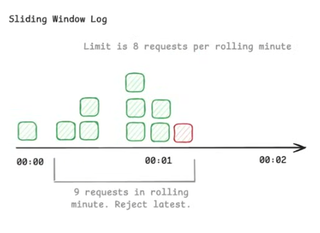

# System Design

## Overview
A rate limiter controls how many requests a client can make within a specific timeframe. It acts like a traffic controller for your API - allowing, for example, 100 requests per minute ffrom a user, then rejecting excess requests with an HTTP 429 'Too Many Requests' response. Rate limiters prevent abuse, protect your servers from being overwhelemed by bursts of traffic, and ensure fair usage cross all users.

## Requirements
### Functional
  - identify users by id, IP, or api key
  - limit requests based on configurable rules
  - return proper error headsers and status codes

### Non Functional
#### Scale
  - 10^8 DAU
  - 10^6 rps

#### CAP
  - availability >> consistency
    - We don't care if the rate limiter has the most up to date rules
    - We do care if the rate limiter would have to go down as that would bottleneck or bring down our system.
  - low latency
    - low latency rate limit checks ( < 10 ms)
    - very important because this will interact with many user requests
    - scale to 1M rps

## Core Entities
  - Request
  - Client (IP, userId, Api key) 
  - Rules (100 r/s)

## API / System Interface
  isRequestAllowed(clientId, rulesId) -> {passes: boolean, remaining: number, resetTime: timestamp }

## High Level Design

### Rate limiting algorithms
---
#### Fixed Window Counter

Downsides:
  - Starvation
    - If after making too many requests you are rate limited from some extended period ... that's a poor user experience.
  - Boundary Effect
    - If users make requests at the boundaries ... they can make double the amount of requests.

#### Sliding Window

## Deep Dives

